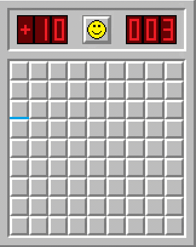

# MineSweeper

Windows XP style Mine Sweeper game written in MIPS assembly

## Installing and Run 

First Get the [Mars MIPS simulator](http://courses.missouristate.edu/kenvollmar/mars/) Then:
* Copy `Mars.jar` to project folder
* Open `MineSweeper.asm` file in Mars IDE
* Assemble the project
* Connect Bitmap Display with following configuration:
  * Display Size    -> `512 * 512`
  * Base Address    -> `0x10040000(heap)`
  * Pixel Units   ->  `2`
* Connect a KeyBoard Simulator
* Hit run and enjoy!

## Authors

* **Vahid Jahandar** - *Technical Designer* - [VahidTvJ](https://github.com/vahidtvj)
* **Ali Porpanah** - *Graphics Designer* - [Ali035](https://github.com/Ali035)
* **Amir Ahmad Amjadi** - *Initial Work*

## License

This project is licensed under the [MIT License](LICENSE)
